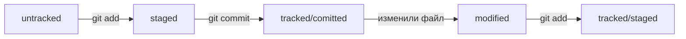

# Шпаргалка markdown
## Выделдение текста
Вы можете выделять текст в markdown с помощью символов _ или *. Например:

Пример _курсива_ и **жирного** текста.
## Заголовки
Заголовки можно создавать с помощью символа #. Чем больше #, тем меньше заголовок. Например:

# Заголовок первого уровня
## Заголовок второго уровня
### Заголовок третьего уровня
## Выделение кода 
Чтобы выделить текст как код, поместите его в тройные ковычки

```bash
mkdir my_project
cd my_project
git init
```
Это лишь некоторые функции markdown

[GitHub](https://github.com/)

[Репозиторий](https://github.com/m3ld/first-project "https://github.com/m3ld/first-project")

# Жизненный цикл файла в Git:


